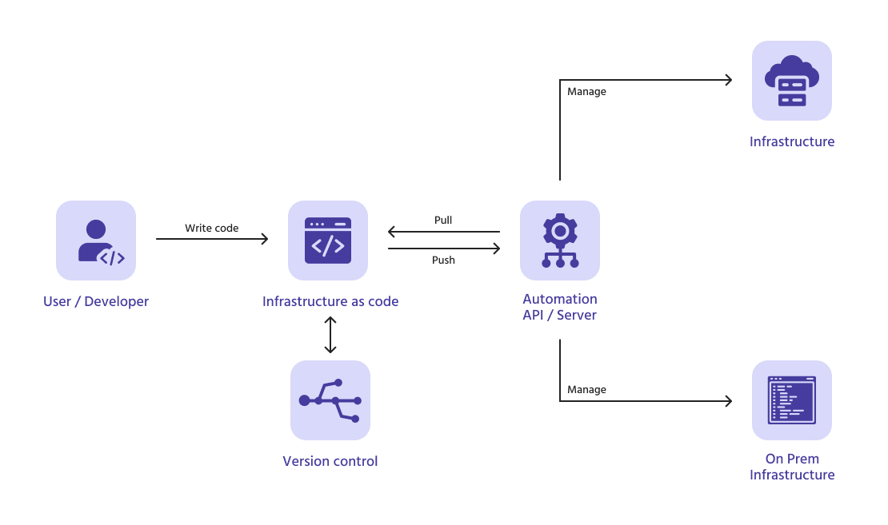
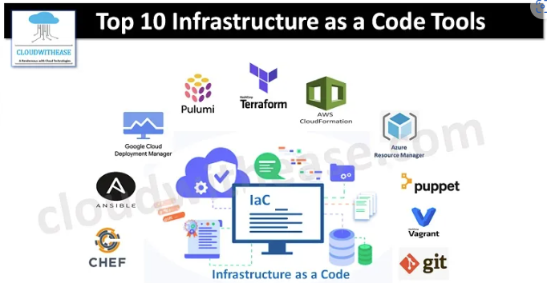

# Infrastructure as Code (IaC)

- [Infrastructure as Code (IaC)](#infrastructure-as-code-iac)
- [What is IaC?](#what-is-iac)
  - [Benefits of IaC](#benefits-of-iac)
    - [Detailed Benefits of IaC](#detailed-benefits-of-iac)
    - [Key Benefits of IaC and CI/CD for Customers](#key-benefits-of-iac-and-cicd-for-customers)
  - [When/Where to Use IaC](#whenwhere-to-use-iac)
  - [What are the Tools Available for IaC?](#what-are-the-tools-available-for-iac)
    - [Configuration management tools](#configuration-management-tools)
    - [Why Are They Important?](#why-are-they-important)
    - [How Do They Work?](#how-do-they-work)
  - [Orchestration tools](#orchestration-tools)
    - [Terraform](#terraform)
    - [AWS CloudFormation](#aws-cloudformation)
    - [Ansible](#ansible)
    - [Why Use Orchestration Tools?](#why-use-orchestration-tools)
    - [Declarative and Imperative](#declarative-and-imperative)
- [What is Configuration Management (CM)?](#what-is-configuration-management-cm)
- [What is Provisioning of Infrastructure? Do CM Tools Do It?](#what-is-provisioning-of-infrastructure-do-cm-tools-do-it)
- [What is Ansible and How Does It Work?](#what-is-ansible-and-how-does-it-work)
  - [How Does Ansible Work?](#how-does-ansible-work)
  - [Key Features of Ansible](#key-features-of-ansible)
    - [Example Use Cases:](#example-use-cases)
  - [Key Features of Ansible Playbooks](#key-features-of-ansible-playbooks)
      - [Declarative Syntax](#declarative-syntax)
      - [Tasks and Plays](#tasks-and-plays)
      - [Modules](#modules)
      - [Idempotency](#idempotency)
  - [How Ansible Playbooks Work](#how-ansible-playbooks-work)
  - [Ansible Controller (Control Node)](#ansible-controller-control-node)
    - [Role of the Controller:](#role-of-the-controller)
    - [Key Functions:](#key-functions)
- [Who is Using IaC and Ansible in the Industry?](#who-is-using-iac-and-ansible-in-the-industry)
- [Research](#research)
  - [What is pull and push configuration management (IaC)?](#what-is-pull-and-push-configuration-management-iac)
    - [Pull configuration management](#pull-configuration-management)
    - [Push configuration management](#push-configuration-management)
  - [Which tools support push/pull?](#which-tools-support-pushpull)
    - [Pull-based tools](#pull-based-tools)
    - [Push-based tools](#push-based-tools)
  - [Does Terraform use the push or pull configuration?](#does-terraform-use-the-push-or-pull-configuration)
  - [Which is better: push or pull configuration management?](#which-is-better-push-or-pull-configuration-management)
    - [Push model](#push-model)
    - [Pull model](#pull-model)
- [Desired State vs Current State](#desired-state-vs-current-state)
  - [Desired State](#desired-state)
  - [Current State](#current-state)
- [Conclusion](#conclusion)

Source: https://www.linkedin.com/pulse/enabling-infrastructure-code-iac-cicd-key-benefits-customers-bilal/

# What is IaC?
* Infrastructure as Code (IaC) is a way to **manage and provision computer data centers through machine-readable definition files**, rather than physical hardware configuration or interactive configuration tools. 
* With IaC, organisations can define their infrastructure in a text file, which can be version controlled and deployed automatically using tools like Terraform, Ansible, and Chef
  
> Think of it like writing code to set up and manage your servers, networks, and other infrastructure, instead of doing it manually.

Source: https://scand.com/company/blog/infrastructure-as-code/

 

## Benefits of IaC
* **Consistency**: Ensures that the same environment is created every time, reducing errors.
* ⏩🏃🏻‍♀️‍➡️**Speed**: Automates the setup process, making it much faster.
* 📈**Scalability**: Easily replicate environments across different locations.
* **Version Control**: Track changes and revert to previous configurations if needed.
* 💵🫰🏻**Cost Efficiency**: Reduces manual labor and potential downtime.

 

### Detailed Benefits of IaC
* **Version Control**: Infrastructure definitions can be version controlled, which provides traceability and accountability for infrastructure changes. 
  * Version control systems enable you to see who made the changes, when they made them, and what changes were made.
* **Reusability**: IaC enables organisations to reuse code for infrastructure components like servers, databases, and networks. 
  * This helps to reduce duplication of effort and increases efficiency.
* **Consistency**: Infrastructure definitions can be tested and validated before deployment, which ensures consistency in the environment. 
  * This helps to prevent issues caused by manual configuration errors.

 

### Key Benefits of IaC and CI/CD for Customers
* **Faster Time-to-Market**: IaC and CI/CD enable organisations to deploy changes quickly, which helps to reduce the time it takes to bring new features to market. 
  * This enables organisations to remain competitive and meet customer

* **Improved Quality**: IaC and CI/CD enable organisations to test changes automatically, which helps to identify issues early in the development process. 
  * Automated testing ensures that code changes meet the required quality standards before they are deployed to production. 
  * This reduces the risk of defects, security vulnerabilities, and performance issues.

* **Reduced Costs**: IaC and CI/CD help to reduce costs by automating repetitive tasks and reducing manual effort. 
  * This helps to minimise the time and effort required for infrastructure and software deployments. 
  * Automation also helps to reduce the risk of human error, which can lead to costly downtime and remediation efforts.

* **Increased Agility**: IaC and CI/CD enable organisations to be more agile by providing the ability to make changes quickly and efficiently. 
  * With IaC, infrastructure changes can be made in a matter of minutes or hours, compared to days or weeks with manual processes. 
  * This enables organisations to respond to market changes and customer feedback more quickly and efficiently.

 

## When/Where to Use IaC
IaC is useful whenever you need to **manage infrastructure**, especially in environments that require frequent updates or scaling. 

Where to use IaC:
* **Time Saver**: You need to think about 'how much time is this going to save me?'. Is it worth investing the time? 
  * Creating Images.
  * CLI Commands that you can run manually. You could put these commands into a script that runs the commands for you. 
* **Cloud environments**: Automating the setup of cloud resources.
* **Development and testing**: Quickly setting up consistent environments for developers and testers.
* **Production**: Ensuring reliable and repeatable deployments.

Example Use Cases:
* **Cloud Infrastructure**: Setting up virtual machines, storage, networking.
* **CI/CD Pipelines**: Automating the deployment process.
* **Multi-Region Deployments**: Consistent setup across different locations.

 

## What are the Tools Available for IaC?
* **Terraform**: A widely-used tool that works with many cloud providers.
* **AWS CloudFormation**: A tool specific to Amazon Web Services.
* **Azure Resource Manager**: For managing resources in Microsoft Azure.
* **Google Cloud Deployment Manager**: For Google Cloud Platform.
* **Ansible**, **Chef**, **Puppet**: These tools also handle configuration management.

 

Source: https://cloudwithease.com/top-10-infrastructure-as-a-code-or-iac-tools/

 

### Configuration management tools
* Helps **automate** the **management and tracking** of IT **infrastructure**, ensuring consistency and reliability across different environments.
  * Ansible.
  * Puppet. 
  * Chef. 

> Configuration management tools are like helpers that make sure all the parts of your IT setup (like servers, databases, and networks) are set up correctly and stay that way.

| **Tool**      | **Description**                                                                 |
|---------------|---------------------------------------------------------------------------------|
| **Ansible**   | Known for its simplicity and ease of use, Ansible automates software provisioning, configuration management, and application deployment. |
| **Chef**      | Focuses on configuration management and automation, using a Ruby-based DSL (domain-specific language) for writing configuration scripts. |
| **Puppet**    | Provides configuration management and deployment automation, using a declarative language to define system configurations. |

 

### Why Are They Important?
* **Automation**: They automate the process of setting up and managing your IT infrastructure, so you don’t have to do everything manually.
* **Consistency**: They ensure that everything is set up the same way every time, which helps avoid mistakes.
* **Reliability**: They keep track of changes and make sure everything works smoothly across different environments (like development, testing, and production).

### How Do They Work?
* **Define Configurations**: You write down how you want your infrastructure to be set up using a specific language or tool.
* **Apply Configurations**: The tool takes your instructions and sets up the infrastructure accordingly.
* **Manage Changes**: If you need to make changes, the tool helps you update the setup without breaking anything.

 

## Orchestration tools
* Orchestration tools help you **manage** and **automate** the **setup and coordination** of your IT **infrastructure**. 
  
> Think of them as the conductors of an orchestra, making sure all the different parts (like servers, databases, and networks) work together smoothly.
### Terraform
* **Description**: Terraform is an open-source tool developed by HashiCorp. 
  * It allows you to define and manage infrastructure across multiple cloud providers using a declarative configuration language (HCL - HashiCorp Configuration Language).
* **Use Cases**: Ideal for multi-cloud environments, infrastructure provisioning, and managing resources like servers, databases, and networking.

### AWS CloudFormation
* **Description**: AWS CloudFormation is a service provided by Amazon Web Services (AWS) that helps you model and set up your AWS resources. 
  * It uses templates to describe the resources and their dependencies so you can launch and configure them together as a stack.
* **Use Cases**: Automating the setup of AWS resources, managing complex environments, and ensuring consistent deployments.

### Ansible
* **Description**: Ansible is primarily a configuration management tool but can also be used for orchestration.
  * It uses a simple, human-readable language (YAML) to describe automation jobs, which can include provisioning, configuration management, and application deployment.
* **Use Cases**: Automating repetitive tasks, orchestrating multi-tier deployments, and managing configurations across different environments.

 

### Why Use Orchestration Tools?
* **Consistency**: Ensures that your infrastructure is set up the same way every time.
* **Efficiency**: Saves time by automating repetitive tasks.
* **Scalability**: Makes it easier to manage large and complex environments.

 

### Declarative and Imperative
| **Type**               | **Description**                                                                 | **Examples**                                                                                     |
|------------------------|---------------------------------------------------------------------------------|--------------------------------------------------------------------------------------------------|
| **Declarative IaC Tools** | These tools specify the desired end state of the infrastructure, and the tool automatically configures it to match that state. | Terraform, AWS CloudFormation, Azure Resource Manager, Google Cloud Deployment Manager |
| **Imperative IaC Tools**  | These tools specify the exact steps needed to achieve the desired configuration. | Ansible, Chef, Puppet, SaltStack                                                

 

# What is Configuration Management (CM)?
* Configuration Management (CM) is a process for **maintaining the consistency** of a product’s **performance**, **functional**, and **physical attributes** with its **requirements**, **design**, and **operational information** throughout its life. 
* It helps ensure that systems perform as expected and can be easily managed and updated.

 

# What is Provisioning of Infrastructure? Do CM Tools Do It?
* Provisioning of infrastructure involves **setting up the necessary hardware** and **software** to **support applications**. 
* This includes servers, storage, networking, and more. 
  * Some CM tools, like Ansible and Chef, can also handle provisioning by automating the setup of these resources.

 

# What is Ansible and How Does It Work?
* Ansible is an **open-source tool** used for **IT automation**, including **configuration management**, **application deployment**, and **task automation**. 
* It works by **connecting to your nodes** (servers, devices, etc.) and **pushing out small programs** called “Ansible modules” **to perform tasks**. 
  * These modules are executed over SSH, and the results are returned to the Ansible server.
* An Ansible playbook is a file written in YAML (Yet Another Markup Language) that defines a series of tasks to be executed on your managed nodes (servers, devices, etc.). 
  * Playbooks are used to automate and manage configurations, deployments, and other IT tasks.

 

## How Does Ansible Work?
1. **Connecting to Nodes**
   * Ansible connects to your nodes (which can be servers, devices, or any other infrastructure components) using SSH (Secure Shell). 
   * This means you don’t need to install any special software on the nodes themselves.
2. **Pushing Ansible Modules**
   * Ansible uses small programs called “modules” to perform tasks. 
   * These modules are pushed out to the nodes from the Ansible server (also known as the control node).
3. **Executing Modules**
   * The modules are executed on the nodes over SSH. This means Ansible can run commands and scripts on the nodes to perform the required tasks.
4. **Returning Results**
   * After executing the modules, the results are sent back to the Ansible server. 
   * This allows you to see what changes were made and if there were any issues.

 

## Key Features of Ansible
* **Agentless**: Unlike some other tools, Ansible doesn’t require any agents to be installed on the nodes. 
  * It uses SSH for communication, which simplifies the setup and reduces overhead.
* **Declarative Language**: Ansible uses a simple, human-readable language called YAML (Yet Another Markup Language) to define automation tasks. 
  * This makes it easy to write and understand the automation scripts.
* **Idempotent**: Ansible ensures that running the same task multiple times will produce the same result. 
  * This means you can safely re-run your automation scripts without worrying about unintended changes.

### Example Use Cases:
* **Provisioning**: Setting up new servers and configuring them with the necessary software and settings.
* **Configuration Management**: Ensuring that all servers have the same configuration and are up-to-date.
* **Application Deployment**: Automating the deployment of applications to different environments (development, testing, production).
* **Orchestration**: Coordinating complex workflows and processes across multiple systems.

 

## Key Features of Ansible Playbooks
#### Declarative Syntax
* Playbooks use a simple, human-readable syntax in YAML, making them easy to write and understand.

#### Tasks and Plays
* A playbook consists of one or more “plays.” Each play maps a group of hosts to a set of tasks.
* Tasks are the individual actions that Ansible performs, such as installing a package, starting a service, or copying a file.

#### Modules
* Tasks in a playbook use Ansible modules, which are small programs that perform specific actions. 
  * For example, the yum module can install packages on a Red Hat-based system.

#### Idempotency
* Playbooks are designed to be idempotent, meaning that running the same playbook multiple times will produce the same result without causing unintended changes.

## How Ansible Playbooks Work
1. **Define the Playbook**
   * You write a playbook in YAML, specifying the hosts to target and the tasks to perform.

2. **Execute the Playbook**
   * You run the playbook using the ansible-playbook command. 
   * Ansible connects to the specified hosts over SSH and executes the tasks in the order they are written.

3. **Modules Execution**
   * Each task calls an Ansible module, which performs the specified action on the target hosts. The results are then returned to the Ansible server.

 

## Ansible Controller (Control Node)
*  The **controller** (also known as the control node) is the **machine where Ansible is installed** and **from** which you **run your automation tasks**. 

### Role of the Controller:
* The controller is the central point from which you manage your infrastructure.
* It runs the Ansible commands and playbooks, connecting to your managed nodes (servers, devices, etc.) over SSH.

### Key Functions:
* **Executing Playbooks**
  * The controller reads and executes the playbooks you write, sending tasks to the managed nodes.

* **Managing Inventory**
  * The controller maintains an inventory of the nodes it manages. 
  * This inventory can be a simple text file listing the nodes or a more dynamic source like a cloud provider’s API.

* **Connecting to Nodes**
  * The controller uses SSH to connect to the managed nodes. 
  * This means you don’t need to install any special software on the nodes themselves.

* **Running Modules**
  * The controller sends small programs called modules to the nodes to perform specific tasks. 
  * These modules are executed on the nodes, and the results are sent back to the controller.

 

# Who is Using IaC and Ansible in the Industry?
* **Tech giants** like Google, Amazon, and Microsoft for managing their vast cloud infrastructures.
* **Financial institutions** for ensuring secure and consistent environments.
* **Healthcare** providers for managing sensitive data and compliance.
* **Startups** for quickly scaling their infrastructure as they grow.

  

# Research

## What is pull and push configuration management (IaC)?
### Pull configuration management 
* In a pull model, each target machine (like a server) **pulls** its **configuration from a central server or management system**. 
* This happens periodically, where the machines use an **agent** to **check and update** their own configurations as needed. 
* This method is common in continuous management where machines need to **stay up-to-date** with the latest policies and configurations.

* Example: Puppet and Chef use this approach. 
  * **Agents** installed on machines **reach out to a central server** to **fetch** their latest **configurations**.

 

### Push configuration management 
* In a push model, the controlling server **pushes configurations directly to the target machines**. 
* This is usually done over a connection like **SSH** and **does not require an agent** running on the target machines. 
* This method is more **direct** and is often used when you need to **apply changes immediately**.

* Example: Ansible, Terraform, and AWS CloudFormation use this approach. 
  * The controlling system (like a laptop running Terraform) **pushes the infrastructure changes** to the target cloud providers or servers.

 

 

## Which tools support push/pull?
### Pull-based tools
* **Puppet and Chef**: Both use agents on machines that pull configurations periodically from a central server.

### Push-based tools
* **Ansible**: Pushes changes directly from the controlling machine to the targets over **SSH**.
* **Terraform**: Pushes changes to cloud infrastructure via **API calls**, making it more declarative but push-based.
* **AWS CloudFormation**: Also uses a push model when managing AWS infrastructure.

 

## Does Terraform use the push or pull configuration?
* Terraform uses the **push** model. 
* It **defines the desired state** of infrastructure in code and then **pushes the configuration** changes to cloud providers like AWS using their APIs. 
* This means it **does not require an agent** on the target systems, but rather **directly interacts with APIs** to apply the changes​ PUPPETEERS.

## Which is better: push or pull configuration management?
There’s no definitive "better" model — it depends on the use case.

 

### Push model 
* Is typically better for **provisioning infrastructure** and when you need **immediate application of changes**. 
* Tools like Terraform or Ansible excel in this for cloud infrastructure or one-time setups.

### Pull model 
* Is often better for **continuous configuration management**, where systems need to **regularly check in** and **stay updated** with the latest configurations. 
* Tools like Puppet and Chef are ideal for this.

> If you need ongoing, regular configuration updates, **pull** tools might be a better fit.
> 
> If you need to set up infrastructure or apply changes instantly, **push** tools are often more efficient​. 

 

# Desired State vs Current State
## Desired State
* In IaC, the desired state refers to the **configuration or infrastructure that is defined in code**. 
* This is how you want the infrastructure to look after all changes are applied. 
  * For example, in Terraform, the desired state is defined in the .tf files (e.g., how many VMs you want, what networks they belong to, etc.).

## Current State
* This refers to the actual state of the infrastructure at any given time. 
  * For example, if you’ve defined 3 virtual machines in your desired state but only 2 exist in reality, there is a difference between the desired and current states.

Tools like Terraform use a state file (terraform.tfstate) to track the current state of the infrastructure. When you run terraform apply, it compares the current state (tracked in the state file) to the desired state (defined in code) and applies changes to align the two​.

# Conclusion
* Push-based models (like Terraform and Ansible) are well-suited for provisioning and immediate changes.
* Pull-based models (like Puppet and Chef) are ideal for environments needing continuous configuration management and synchronization.
* Both push and pull models have their use cases, and the choice depends on the specific infrastructure management needs.