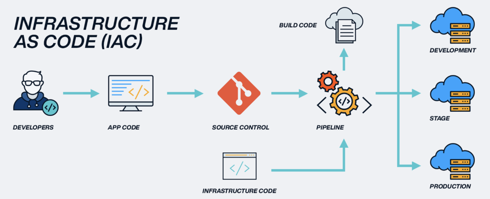

# Infrastructure as Code (IaC)

- [Infrastructure as Code (IaC)](#infrastructure-as-code-iac)
- [What is IaC?](#what-is-iac)
  - [Benefits of IaC](#benefits-of-iac)
    - [Detailed Benefits of IaC](#detailed-benefits-of-iac)
    - [Key Benefits of IaC and CI/CD for Customers](#key-benefits-of-iac-and-cicd-for-customers)
  - [When/Where to Use IaC](#whenwhere-to-use-iac)
  - [What are the Tools Available for IaC?](#what-are-the-tools-available-for-iac)
    - [Configuration management tools](#configuration-management-tools)
    - [Why Are They Important?](#why-are-they-important)
    - [How Do They Work?](#how-do-they-work)
  - [Orchestration tools](#orchestration-tools)
    - [Terraform](#terraform)
    - [AWS CloudFormation](#aws-cloudformation)
    - [Ansible](#ansible)
    - [Why Use Orchestration Tools?](#why-use-orchestration-tools)
    - [Declarative and Imperative](#declarative-and-imperative)
- [What is Configuration Management (CM)?](#what-is-configuration-management-cm)
- [What is Provisioning of Infrastructure? Do CM Tools Do It?](#what-is-provisioning-of-infrastructure-do-cm-tools-do-it)
- [What is Ansible and How Does It Work?](#what-is-ansible-and-how-does-it-work)
- [Who is Using IaC and Ansible in the Industry?](#who-is-using-iac-and-ansible-in-the-industry)

Source: https://www.linkedin.com/pulse/enabling-infrastructure-code-iac-cicd-key-benefits-customers-bilal/

# What is IaC?
* Infrastructure as Code (IaC) is a way to **manage and provision computer data centers through machine-readable definition files**, rather than physical hardware configuration or interactive configuration tools. 
* With IaC, organisations can define their infrastructure in a text file, which can be version controlled and deployed automatically using tools like Terraform, Ansible, and Chef
  
> Think of it like writing code to set up and manage your servers, networks, and other infrastructure, instead of doing it manually.

Source: https://scand.com/company/blog/infrastructure-as-code/

 

## Benefits of IaC
* **Consistency**: Ensures that the same environment is created every time, reducing errors.
* ⏩🏃🏻‍♀️‍➡️**Speed**: Automates the setup process, making it much faster.
* 📈**Scalability**: Easily replicate environments across different locations.
* **Version Control**: Track changes and revert to previous configurations if needed.
* 💵🫰🏻**Cost Efficiency**: Reduces manual labor and potential downtime.

 

### Detailed Benefits of IaC
* **Version Control**: Infrastructure definitions can be version controlled, which provides traceability and accountability for infrastructure changes. 
  * Version control systems enable you to see who made the changes, when they made them, and what changes were made.
* **Reusability**: IaC enables organisations to reuse code for infrastructure components like servers, databases, and networks. 
  * This helps to reduce duplication of effort and increases efficiency.
* **Consistency**: Infrastructure definitions can be tested and validated before deployment, which ensures consistency in the environment. 
  * This helps to prevent issues caused by manual configuration errors.

 

### Key Benefits of IaC and CI/CD for Customers
* **Faster Time-to-Market**: IaC and CI/CD enable organisations to deploy changes quickly, which helps to reduce the time it takes to bring new features to market. 
  * This enables organisations to remain competitive and meet customer

* **Improved Quality**: IaC and CI/CD enable organisations to test changes automatically, which helps to identify issues early in the development process. 
  * Automated testing ensures that code changes meet the required quality standards before they are deployed to production. 
  * This reduces the risk of defects, security vulnerabilities, and performance issues.

* **Reduced Costs**: IaC and CI/CD help to reduce costs by automating repetitive tasks and reducing manual effort. 
  * This helps to minimise the time and effort required for infrastructure and software deployments. 
  * Automation also helps to reduce the risk of human error, which can lead to costly downtime and remediation efforts.

* **Increased Agility**: IaC and CI/CD enable organisations to be more agile by providing the ability to make changes quickly and efficiently. 
  * With IaC, infrastructure changes can be made in a matter of minutes or hours, compared to days or weeks with manual processes. 
  * This enables organisations to respond to market changes and customer feedback more quickly and efficiently.

 

## When/Where to Use IaC
IaC is useful whenever you need to **manage infrastructure**, especially in environments that require frequent updates or scaling. 

Where to use IaC:
* **Time Saver**: You need to think about 'how much time is this going to save me?'. Is it worth investing the time? 
  * Creating Images.
  * CLI Commands that you can run manually. You could put these commands into a script that runs the commands for you. 
* **Cloud environments**: Automating the setup of cloud resources.
* **Development and testing**: Quickly setting up consistent environments for developers and testers.
* **Production**: Ensuring reliable and repeatable deployments.

Example Use Cases:
* **Cloud Infrastructure**: Setting up virtual machines, storage, networking.
* **CI/CD Pipelines**: Automating the deployment process.
* **Multi-Region Deployments**: Consistent setup across different locations.

 

## What are the Tools Available for IaC?
* **Terraform**: A widely-used tool that works with many cloud providers.
* **AWS CloudFormation**: A tool specific to Amazon Web Services.
* **Azure Resource Manager**: For managing resources in Microsoft Azure.
* **Google Cloud Deployment Manager**: For Google Cloud Platform.
* **Ansible**, **Chef**, **Puppet**: These tools also handle configuration management.

### Configuration management tools
* Helps **automate** the **management and tracking** of IT **infrastructure**, ensuring consistency and reliability across different environments.
  * Ansible.
  * Puppet. 
  * Chef. 

> Configuration management tools are like helpers that make sure all the parts of your IT setup (like servers, databases, and networks) are set up correctly and stay that way.

| **Tool**      | **Description**                                                                 |
|---------------|---------------------------------------------------------------------------------|
| **Ansible**   | Known for its simplicity and ease of use, Ansible automates software provisioning, configuration management, and application deployment. |
| **Chef**      | Focuses on configuration management and automation, using a Ruby-based DSL (domain-specific language) for writing configuration scripts. |
| **Puppet**    | Provides configuration management and deployment automation, using a declarative language to define system configurations. |

 

### Why Are They Important?
* **Automation**: They automate the process of setting up and managing your IT infrastructure, so you don’t have to do everything manually.
* **Consistency**: They ensure that everything is set up the same way every time, which helps avoid mistakes.
* **Reliability**: They keep track of changes and make sure everything works smoothly across different environments (like development, testing, and production).

### How Do They Work?
* **Define Configurations**: You write down how you want your infrastructure to be set up using a specific language or tool.
* **Apply Configurations**: The tool takes your instructions and sets up the infrastructure accordingly.
* **Manage Changes**: If you need to make changes, the tool helps you update the setup without breaking anything.

 

## Orchestration tools
* Orchestration tools help you **manage** and **automate** the **setup and coordination** of your IT **infrastructure**. 
  
> Think of them as the conductors of an orchestra, making sure all the different parts (like servers, databases, and networks) work together smoothly.
### Terraform
* **Description**: Terraform is an open-source tool developed by HashiCorp. 
  * It allows you to define and manage infrastructure across multiple cloud providers using a declarative configuration language (HCL - HashiCorp Configuration Language).
* **Use Cases**: Ideal for multi-cloud environments, infrastructure provisioning, and managing resources like servers, databases, and networking.

### AWS CloudFormation
* **Description**: AWS CloudFormation is a service provided by Amazon Web Services (AWS) that helps you model and set up your AWS resources. 
  * It uses templates to describe the resources and their dependencies so you can launch and configure them together as a stack.
* **Use Cases**: Automating the setup of AWS resources, managing complex environments, and ensuring consistent deployments.

### Ansible
* **Description**: Ansible is primarily a configuration management tool but can also be used for orchestration.
  * It uses a simple, human-readable language (YAML) to describe automation jobs, which can include provisioning, configuration management, and application deployment.
* **Use Cases**: Automating repetitive tasks, orchestrating multi-tier deployments, and managing configurations across different environments.

 

### Why Use Orchestration Tools?
* **Consistency**: Ensures that your infrastructure is set up the same way every time.
* **Efficiency**: Saves time by automating repetitive tasks.
* **Scalability**: Makes it easier to manage large and complex environments.

 

### Declarative and Imperative
| **Type**               | **Description**                                                                 | **Examples**                                                                                     |
|------------------------|---------------------------------------------------------------------------------|--------------------------------------------------------------------------------------------------|
| **Declarative IaC Tools** | These tools specify the desired end state of the infrastructure, and the tool automatically configures it to match that state. | Terraform, AWS CloudFormation, Azure Resource Manager, Google Cloud Deployment Manager |
| **Imperative IaC Tools**  | These tools specify the exact steps needed to achieve the desired configuration. | Ansible, Chef, Puppet, SaltStack                                                                 |

 

Source: https://cloudwithease.com/top-10-infrastructure-as-a-code-or-iac-tools/

 

# What is Configuration Management (CM)?
* Configuration Management (CM) is a process for **maintaining the consistency** of a product’s **performance**, **functional**, and **physical attributes** with its **requirements**, **design**, and **operational information** throughout its life. 
* It helps ensure that systems perform as expected and can be easily managed and updated.

 

# What is Provisioning of Infrastructure? Do CM Tools Do It?
* Provisioning of infrastructure involves **setting up the necessary hardware** and **software** to **support applications**. 
* This includes servers, storage, networking, and more. 
  * Some CM tools, like Ansible and Chef, can also handle provisioning by automating the setup of these resources.

 

# What is Ansible and How Does It Work?
* Ansible is an **open-source tool** used for **IT automation**, including **configuration management**, **application deployment**, and **task automation**. 
* It works by **connecting to your nodes** (servers, devices, etc.) and **pushing out small programs** called “Ansible modules” **to perform tasks**. 
  * These modules are executed over SSH, and the results are returned to the Ansible server.

 

# Who is Using IaC and Ansible in the Industry?
* **Tech giants** like Google, Amazon, and Microsoft for managing their vast cloud infrastructures.
* **Financial institutions** for ensuring secure and consistent environments.
* **Healthcare** providers for managing sensitive data and compliance.
* **Startups** for quickly scaling their infrastructure as they grow.

  

