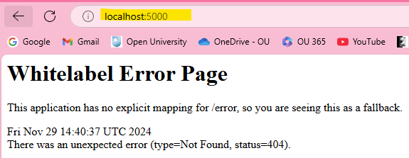
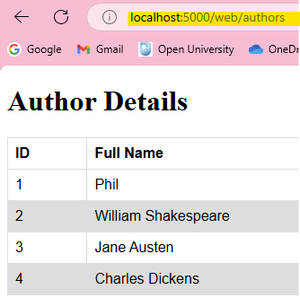

A repo containing:
* database-definitions.yml file.
* app-definitions.yml file.
* provisioning script (not tested). 

Use port forwarding to access the application locally:
`kubectl port-forward spring-sparta-app-deployment-5765875697-cv99s 5000:5000`
Then, open your browser and navigate to:
`http://localhost:5000`

Then, open your browser and navigate to:
`http://localhost:5000/web/authors`

 

If you want to see where your provision script is at with your commands, you can run: `tail -f /var/log/cloud-init-output.log`. 
