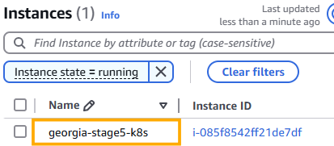
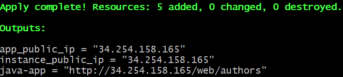

Link to "how to" notes: [text](../../tech264-terraform/tf-instance/tf-instance.md)

# Spring Boot Project Stage 5: Using Terraform

## Terraform Architecture
```bash
k8s repo
└── terraform-project-stage5
    ├── infrastructure
    │   └── main.tf
    └── minikube-files
        ├── app-definitions.yml
        ├── database-definitions.yml
        ├── library.sql
        └── prov.sh
```


## Using the 4 Commands
### terraform init
* Make sure your work on VSC is saved, otherwise it can't initialise. 
* `terraform init`
* Go into your repo with the terraform files within and type `ls` to check your main.tf file is present.

 

### terraform fmt
* Make sure everything is saved on VSC.
* `terraform fmt`
* This is to make sure your formatting within the main.tf file is correct, ensuring that Terraform can read it. 

### terraform plan
* Make sure everything is saved on VSC.
* `terraform plan`
* This can take a moment, please be patient.


* If we were dong a CICD pipeline, it would be a good idea to save the plan.

### terraform apply
* Make sure everything is saved on VSC.
* `terraform apply`


* Enter a value: "yes" (if you're happy with the plan). 
* Now it's creating the EC2 instance.


* Go to AWS > EC2 > Instances to check if the instance has been created!



* SSH into your instance and use: `tail -f /var/log/cloud-init-output.log` to see where your provision script is at with your provision script. 

* Use your link to see if your app is showing. it will only work once the provision script has finished with it's tasks. 
* Use the link retrieved from the "Output" after you 'terraform apply' your file..-



### terraform destory
* Time to destroy everything!
* `terraform destroy`
* "Enter a value": yes
  * You'll notice that on AWS, the instance does not exist anymore. 


<br>